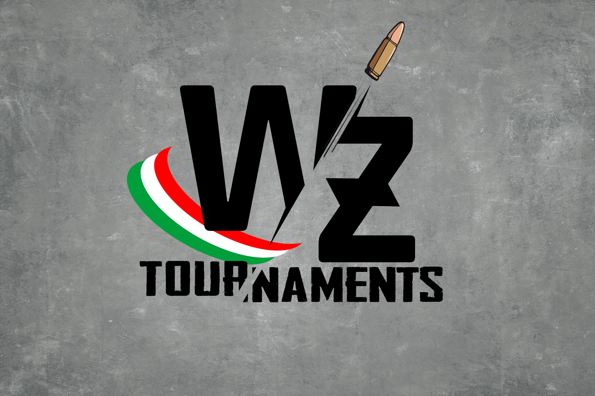

# wztournaments

## What does this this?
This project can be create new tournaments for call of duty warzone.
When every tournaments will finish, the system in automatic calculation and generate ranking with point for players.

## Which tecnology use this project?
- Database: postgresql
- Website: nodejs

## How start this application?
### Configuration database
connection for database can found in `src/COD-MW-WEB/DbAccess/config.json`
```json
{
    "host": "",
    "database": "",
    "user": "",
    "password": "",
    "idleTimeoutMillis": 30000
}
```
### Configuration encrypt
There are password of account activion that we must use it for connect to api cod without ask other password, use it for encrypt with password force, can found in `src/COD-MW-WEB/index.js`
```javascript
...
//password
const key = ""; //example oAHSD980#saDnas!da0sdAS#Dh
...
```

## Configuration database
import this [data.sql](src/COD-MW-WEB/data.sql)

## Privacy
[privacy](src/COD-MW-WEB/Public/Privacy/privacy.pdf)

## terms and conditions
[termini e condizioni](src/COD-MW-WEB/Public/Privacy/termini_e_condizioni.pdf)